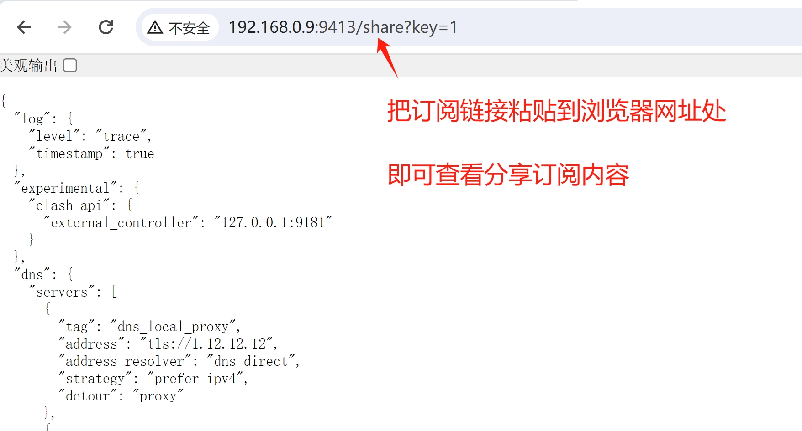

import Tabs from '@theme/Tabs';
import TabItem from '@theme/TabItem';

# 移动端

## 1 在电脑端生成移动端的配置

你需要一台安装了 UIF 的电脑，参考[电脑端的安装教程](./intro.md)。

在电脑上打开 [设置页面](https://uiforfreedom.github.io/#/settings/uif)，点击 `复制分享链接`；此时 `订阅链接` 已经生成好了。

然后粘贴到本地浏览器，网页打开后你会看到`订阅内容`。

## 2 分享到移动端

全选复制电脑端生成的`订阅内容`。通过把订阅内容存放到 txt 文件里面，然后通过微信、邮箱等方式，将电脑生成的`订阅内容`传送到你的手机上。

实际上生成的`订阅内容`就是一串文字，只要能传输到你的移动设备上就行，用户无需在意订阅内容、多余空格或者换行。

:::tip
如果你具有公网IP（VPS、开放端口的局域网），可使用 [更加简洁的方法](../outbound/myself.md) 分享配置到移动端，无需复制粘贴订阅内容。
:::

<Tabs groupId="operating-systems">
<TabItem value="android" label="安卓 Android">

先下载安装：

- [SFA-1.9.3-universal.apk](/assets/release/SFA-universal.apk) （常见）
- [Github 通道（可能打不开）](https://github.com/SagerNet/sing-box/releases/latest)

安装完成后，打开APP，新建订阅:

import android1 from '../pics/m3.png';
import android2 from '../pics/m4.png';
import android3 from '../pics/m5.png';
import android4 from '../pics/m6.png';
import android5 from '../pics/m7.png';
import android6 from '../pics/m8.png';
import android7 from '../pics/m9.png';
import android8 from '../pics/m10.png';
import android9 from '../pics/m11.png';

再次使用时，无需再粘贴 `订阅内容` ，直接“启用”即可；除非`订阅内容`有更新，你需要再次复制粘贴到手机端。

</TabItem>

<TabItem value="ios" label="苹果 iPhone、iPad">

到 `应用商店` 搜索 [sing-box](https://apps.apple.com/us/app/sing-box/id6451272673) 并安装即可。但请先确保你的登录的 Apple ID 的地区不属于中国大陆，否则将无法搜索出来。

import ios1 from '../pics/ios/1.jpg';
import ios2 from '../pics/ios/2.jpg';
import ios3 from '../pics/ios/3-1.jpg';
import ios4 from '../pics/ios/3-2.jpg';
import ios5 from '../pics/ios/3-3.jpg';
import ios6 from '../pics/ios/3-4.jpg';
import ios7 from '../pics/ios/5.jpg';

</TabItem>

</Tabs>
